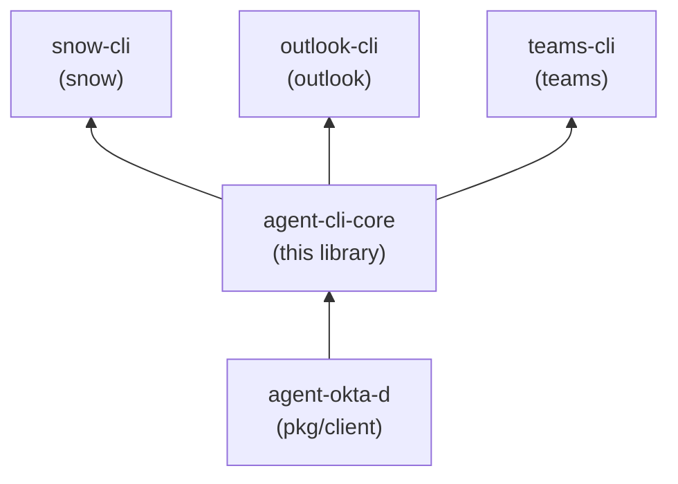

# agent-cli-core

`agent-cli-core` is a planned Go library (module `github.com/stainedhead/agent-cli-core`) holding the behavior shared by the agent-facing CLIs `snow`, `outlook` and `teams`. It has no binary and no vendor clients.

**Status: Draft PRD (v0.1), no code, no release.** This repository currently holds the PRD and project scaffolding. Nothing can be imported yet.

For purpose, wider context and scope boundary, see [INTENT.md](INTENT.md).

## Why it exists

The three CLIs must behave identically where it matters to an autonomous agent: how a token is obtained from the `agent-okta-d` daemon (and never printed), how auth and rate-limit failures map to exit codes, what the output looks like, and how other people's free text is marked untrusted. Putting that in one library keeps the tools thin and prevents drift. The decision to make it its own repository (rather than part of `snow-cli`) was made on 2026-10-03.

## Who consumes it

`snow-cli`, `outlook-cli` and `teams-cli` (separate binaries `snow`, `outlook`, `teams`). Its only upstream dependency is `agent-okta-d` (`pkg/client`).



Arrows read "is depended on by". `agent-okta-d` must publish a tagged release containing `pkg/client` before this library can compile; that is an open item (PRD section 13).

## Packages (planned)

| Package | Responsibility |
|---|---|
| `auth` | `TokenSource` interface; daemon-backed source wrapping `pkg/client`; one forced refresh and retry on 401; `reauth_required` and 403 handling; never prints or logs tokens |
| `policy` | YAML policy engine: allow/deny per verb and resource, field allowlists, limits, write modes |
| `output` | Response envelope, truncation, untrusted-content marking, exit codes 0-9 |
| `audit` | JSONL audit log, no secrets |
| `httpx` | Retries with jitter, `Retry-After` handling, redacted tracing |
| `selftest` | Expected-allow/deny matrix runner |
| `docgen` | Generates the harness skill document from a command tree |

## How a CLI will depend on it

Once a release exists, a CLI declares the dependency in `go.mod` at a released semver tag. There are no pseudo-versions and no `replace` directives on `main`. In CI, each job resolves modules with its own job token (`GITHUB_TOKEN`), with no personal access token or stored secret (PRD section 14.3). No release exists yet.

## Documentation

- [INTENT.md](INTENT.md) - why this library exists and where it fits in the set
- [agent-cli-core-PRD.md](specs/261003-agent-cli-core/agent-cli-core-PRD.md) - the product requirements document
- [AGENTS.md](AGENTS.md) - contributor and agent rules
- [docs/](docs/) - product and technical docs, ADRs
- [user-docs/](user-docs/) - guides for developers who consume the library (none yet)

## Related repositories

Part of the set rooted at [stainedhead/agentic-teams](https://github.com/stainedhead/agentic-teams):

- [agent-okta-d](https://github.com/stainedhead/agent-okta-d) - credential daemon; provides `pkg/client`
- [snow-cli](https://github.com/stainedhead/snow-cli) - ServiceNow CLI
- [outlook-cli](https://github.com/stainedhead/outlook-cli) - mail CLI
- [teams-cli](https://github.com/stainedhead/teams-cli) - Teams CLI
- [agentic-team-w-paperclip](https://github.com/stainedhead/agentic-team-w-paperclip) - container images for the agent harnesses

## Development

```
make fmt vet lint test
```
