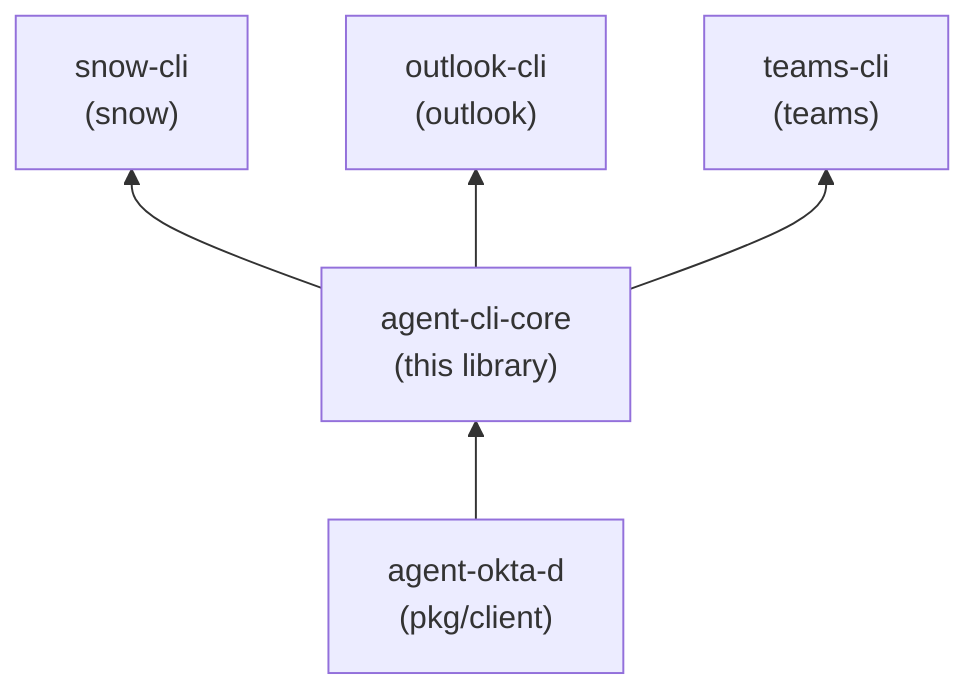

# agent-cli-core

`agent-cli-core` is a Go library (module `github.com/stainedhead/agent-cli-core`) holding the behavior shared by the agent-facing CLIs `snow`, `outlook` and `teams`. It has no binary and no vendor clients.

**Status: implemented and tested; no release has been tagged yet.** Until the first tag (planned `0.1.0`) there is no version to depend on; see "Adding the dependency".

For purpose, wider context and scope boundary, see [INTENT.md](INTENT.md).

## Why it exists

The three CLIs must behave identically where it matters to an autonomous agent: how a token is obtained from the `agent-okta-d` daemon (and never printed), how auth and rate-limit failures map to exit codes, what the output looks like, and how other people's free text is marked untrusted. Putting that in one library keeps the tools thin and prevents drift. The decision to make it its own repository (rather than part of `snow-cli`) was made on 2026-10-03.

## Who consumes it

`snow-cli`, `outlook-cli` and `teams-cli` (separate binaries `snow`, `outlook`, `teams`). Its only upstream dependency is `agent-okta-d` (`pkg/client`).



Arrows read "is depended on by". This library does not import `agent-okta-d` yet: `auth` defines its own small daemon interface, and an adapter over `pkg/client` is deferred until that module has a tagged release.

## Packages

| Package | Responsibility | Guide |
|---|---|---|
| `output` | Response envelope, exit codes 0-9, untrusted-content marking, bounded and pageable output, json/table/text | [output](user-docs/output.md) |
| `auth` | `TokenSource` / `DaemonClient` interfaces, daemon-backed source, redacting token, 401 refresh hook; `auth/authtest` fakes | [auth](user-docs/auth.md) |
| `policy` | Strict-YAML guardrail policy: allow/deny per verb and resource, field allowlists, constraints, write modes, rate limits, caps | [policy](user-docs/policy.md) |
| `audit` | JSON Lines audit log, no secrets, no bodies | [audit](user-docs/audit.md) |
| `httpx` | Retrying HTTP transport: jitter, `Retry-After`, idempotency rules, one refresh on 401, redacted tracing | [httpx](user-docs/httpx.md) |
| `selftest` | Expected-allow/deny matrix runner | [selftest](user-docs/selftest.md) |
| `docgen` | Deterministic SKILL.md from a command tree | [docgen](user-docs/docgen.md) |

Platforms: darwin/arm64, linux/amd64, linux/arm64 (Windows users: WSL2). Go 1.27. One third-party dependency, `github.com/goccy/go-yaml`, used by `policy`.

## Adding the dependency

No version is tagged yet. Once a release exists, declare it at a released semver tag:

```
go get github.com/stainedhead/agent-cli-core@vX.Y.Z
```

(`vX.Y.Z` is a placeholder.) There are no pseudo-versions and no `replace` directives on `main`. In CI, resolve modules with the job's own `GITHUB_TOKEN`; no personal access token is needed.

## Quick look

```go
env := output.Success(items, &output.Meta{})
if err != nil {
    env = output.FromError(err)
}
_ = output.Write(os.Stdout, env, output.Options{})
os.Exit(int(env.ExitCode()))
```

See [Getting started](user-docs/getting-started.md) for the full flow (policy, auth, httpx, output, audit).

## Not included, deferred

Human-mode login (browser PKCE, OS keychain), the adapter over `agent-okta-d` `pkg/client`, a conformance test kit, `apidiff` enforcement and release automation are deferred; some PRD items remain unconfirmed. The full list with reasons is in [Assumptions and deferred work](user-docs/README.md#assumptions-and-deferred-work).

## Documentation

For developers building a CLI on the library:

- [user-docs/README.md](user-docs/README.md) - index of all guides
- [Getting started](user-docs/getting-started.md)
- [Configuration reference](user-docs/configuration.md)
- [Usage examples](user-docs/examples.md)
- Per-package guides: [output](user-docs/output.md), [auth](user-docs/auth.md), [policy](user-docs/policy.md), [audit](user-docs/audit.md), [httpx](user-docs/httpx.md), [selftest](user-docs/selftest.md), [docgen](user-docs/docgen.md)

For contributors:

- [INTENT.md](INTENT.md) - why this library exists and where it fits
- [AGENTS.md](AGENTS.md) - contributor and agent rules
- [docs/](docs/) - [product summary](docs/product-summary.md), [product details](docs/product-details.md), [technical details](docs/technical-details.md), [architectural decision record](docs/architectural-decision-record.md)
- [specs/archive/261003-agent-cli-core/](specs/archive/261003-agent-cli-core/) - the PRD and feature spec

## Related repositories

Part of the set rooted at [stainedhead/agentic-teams](https://github.com/stainedhead/agentic-teams):

- [agent-okta-d](https://github.com/stainedhead/agent-okta-d) - credential daemon; provides `pkg/client`
- [snow-cli](https://github.com/stainedhead/snow-cli) - ServiceNow CLI
- [outlook-cli](https://github.com/stainedhead/outlook-cli) - mail CLI
- [teams-cli](https://github.com/stainedhead/teams-cli) - Teams CLI
- [agentic-team-w-paperclip](https://github.com/stainedhead/agentic-team-w-paperclip) - container images for the agent harnesses

## Development

```
make check      # gofmt, vet, golangci-lint, tests with -race, three-target compile
make vuln       # govulncheck (needs network)
```

There is no `make build`: this is a library.
